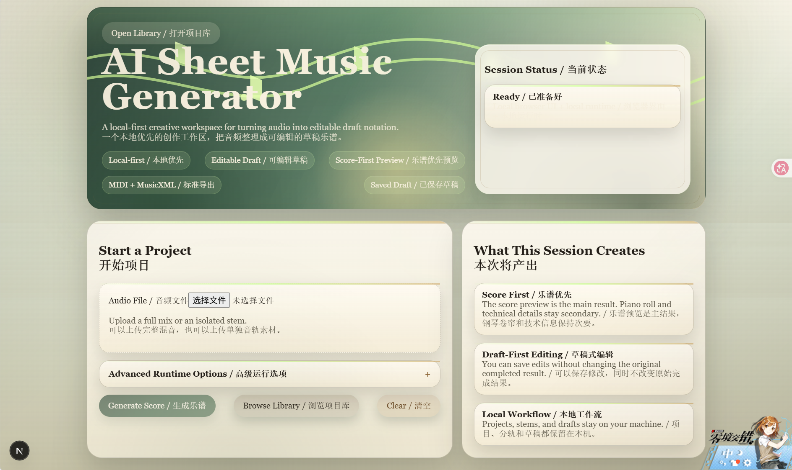
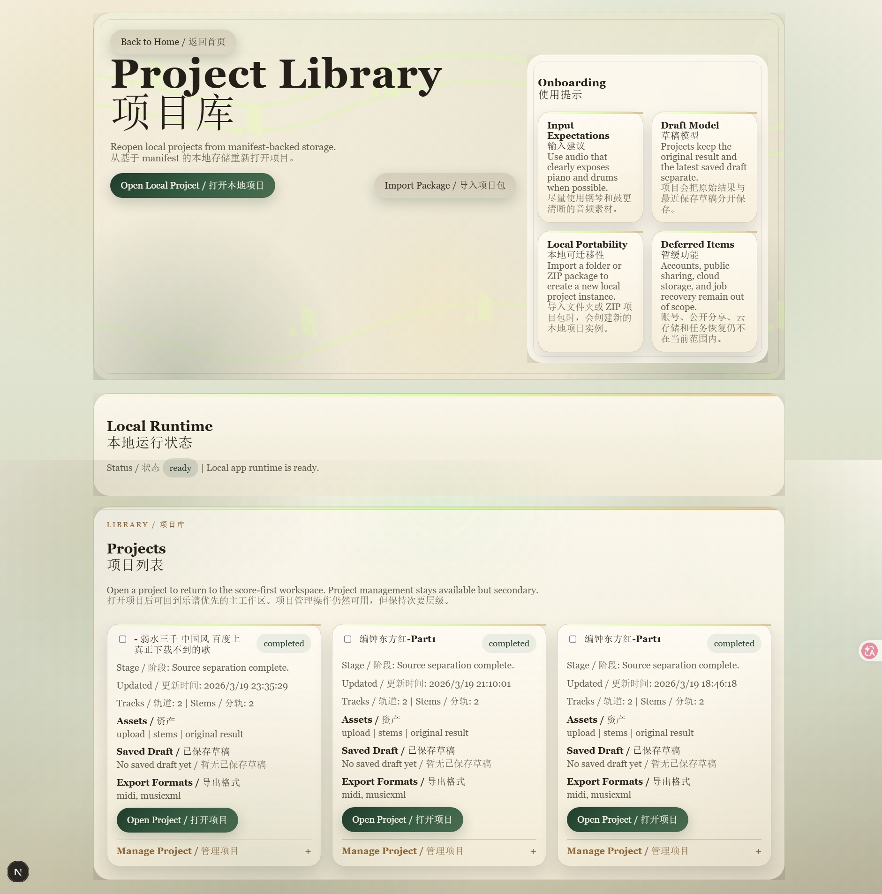
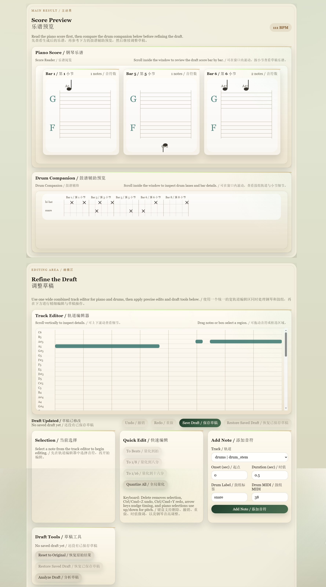

# AI Sheet Music Generator

Turn audio into structured draft notation and export-ready music data — locally, privately, and with a lightweight review workflow.  
将音频转换为结构化草稿记谱与可导出音乐数据 —— 本地运行、隐私优先，并采用轻量复核工作流。

Local-first AI transcription and draft-cleanup with a browser UI, local backend, lightweight editing, and strong export-ready results.  
这是一个本地优先的 AI 转谱与草稿清理工具，采用浏览器界面 + 本地后端，支持轻量编辑与强导出工作流。


---

## Why This Project / 为什么值得关注

- **Local-first by design**  
  **本地优先设计**
- **No cloud upload, no accounts, privacy by default**  
  **无需上传到云端，无需账号，默认保护隐私**
- **Creative workflow: audio -> transcribe -> verify -> export**  
  **创作工作流：音频 -> 转谱 -> 校验 -> 导出**
- **Lightweight browser review, then handoff to MuseScore**  
  **浏览器内轻量复核，然后交接到 MuseScore**

---

## 📸 Demo / 演示

> Add real screenshots in `docs/` for the strongest GitHub presentation.  
> 建议将真实截图放入 `docs/` 目录，以获得更好的 GitHub 展示效果。

### Homepage / 首页

*Magical local-first entry with upload, runtime options, and product overview.*  
*带有上传入口、运行选项与产品概览的本地优先首页。*

### Project Library / 项目库

*Reopen local projects, import packages, and manage your saved work.*  
*重新打开本地项目、导入项目包，并管理已保存的工作内容。*

### Verification Workspace / 轻量校验工作区

*Use lightweight preview, stem audition, and compact editing to verify transcription quality before export.*  
*通过轻量预览、分轨试听与紧凑编辑，在导出前确认转谱质量。*

---

## ✨ Features / 特性

- **Local-first processing**  
  **全部处理在本机完成，无云端依赖**

- **Audio to piano + drum transcription**  
  **将音频转换为钢琴与鼓的转谱结果**

- **Lightweight preview workflow**  
  **以轻量预览为主的结果校验流程**

- **Scrollable score readers for long results**  
  **长结果使用可滚动读谱视窗，浏览更稳定**

- **Editable draft system**  
  **支持草稿编辑，且不会覆盖原始结果**

- **Quick local stem audition for verification**  
  **支持本地分轨快速试听，用于校验分离效果**

- **Saved draft and original result stay separate**  
  **已保存草稿与原始结果保持分离**

- **Reopened projects keep their recorded provider choices when available**  
  **重新打开项目时，如有记录，会保留当时的 provider 选择**

- **Project Library with local persistence**  
  **提供本地持久化的项目库**

- **Separate piano/drum MIDI + MusicXML export**  
  **支持分别导出钢琴/鼓的 MIDI 与 MusicXML**

- **MuseScore handoff for final polishing**  
  **支持交接到 MuseScore 进行最终排版润色**

- **Provider-based quality control**  
  **支持基于 provider 的质量调节**

- **Advanced runtime options with Auto defaults**  
  **高级运行时选项（具有自动默认设置）**

- **Optional enhanced providers install on demand from Runtime Options**  
  **可选的增强型提供程序可在运行时选项中按需安装**

- **Official enhanced providers stay fixed, while extra providers use a local custom manifest registration path**  
  **官方增强型提供者保持不变，而额外的提供者则使用本地自定义的清单注册路径**

- **Custom registration currently adds a local diagnostic entry only, not an execution-ready provider**  
  **当前的自定义注册仅会添加一个本地诊断条目，而不会提供一个可直接执行的提供程序**

- **Result view includes a compact provider-used/fallback summary**  
  **结果视图包含了一个简洁的“提供者使用/备用方案”概要。**

---

## 🚀 Quick Start / 快速开始

```bash
npm install
npm run app
```
Local dependency note / 本地依赖说明：

npm install now brings in a project-local ffmpeg binary automatically for compressed or non-PCM inputs
npm install 会自动带上项目本地的 ffmpeg 可执行文件，用于压缩格式或非 PCM 音频输入

On startup, the app resolves that bundled binary first, then falls back to FFMPEG_EXECUTABLE or a system ffmpeg on PATH if needed
启动时会优先使用项目内置的 ffmpeg，如有需要，再回退到 FFMPEG_EXECUTABLE 或系统 ffmpeg

The backend normalizes formats such as .mp3, .m4a, .aac, .flac, and compatible .wav into a PCM WAV intermediate
后端会将 .mp3、.m4a、.aac、.flac 及兼容 .wav 转换为 PCM WAV 中间文件

Audio uploads are streamed to local disk with a configurable size limit (default: 200 MB)
音频上传采用流式写入本地磁盘，并支持大小限制（默认 200 MB）

Then:

1. **Upload audio**  
   **上传音频**
2. **Generate a transcription draft**  
   **生成转谱草稿**
3. **Review, clean up, and export**  
   **复核、清理并导出**

Open the local URL printed in the terminal.  
打开终端中输出的本地地址即可开始使用。

---

## 🧪 Development / Testing / 开发与测试（可选）

```bash
cd apps/api
./venv/Scripts/python -m pip install -r requirements-dev.txt
```
Required for backend API tests (e.g. httpx)
用于运行后端 API 测试（例如 httpx）

Not required for normal app usage
普通使用无需安装

## 🧠 How It Works / 工作方式

```text
audio
  -> local ffmpeg normalization / PCM WAV handoff
  -> source separation
  -> piano / drum transcription
  -> post-processing
  -> lightweight preview + stem audition
  -> editable draft cleanup
  -> separate piano / drums MIDI / MusicXML export
```

- **Upload a song or stem**  
  **上传完整音频或单独 stem**
- **Run local separation + transcription**  
  **执行本地分离与转谱**
- **Verify the draft with lightweight preview and stem listening**  
  **通过轻量预览与分轨试听确认草稿可用性**
- **Refine obvious issues in-browser**  
  **在浏览器内修正明显问题**
- **Export clean separated output and finish in MuseScore**  
  **导出分开的结构化结果，并在 MuseScore 中完成最终整理**

---

## 🧱 Project Structure / 项目结构

```text
apps/
  web/           Next.js frontend
  api/           FastAPI backend
packages/
  shared-types/  shared DTOs
  music-engine/  music logic
```

apps/web: lightweight review UI, project library, editing workflow
前端界面、项目库与轻量复核/编辑流程

apps/api: upload, jobs, runtime, export
上传、任务处理、运行时与导出

packages/shared-types: shared request/response types
共享类型定义

packages/music-engine: music-domain utilities
音乐处理逻辑模块


## 🎯 Design Philosophy / 设计理念

### Local-first / 本地优先
- Your audio, drafts, and exports stay on your machine.  
  你的音频、草稿与导出结果保留在本机。

### Draft-first / 草稿优先
- The generated result is editable without overwriting the original completed output.  
  生成结果可继续编辑，同时不会覆盖原始完成结果。

### Export-first review / 导出前复核
- The product is built around local transcription, lightweight browser verification, and handoff to MuseScore for final notation polishing.  
  产品围绕“本地转谱、浏览器内轻量校验、再交给 MuseScore 做最终排版”的流程设计。

This combination is what makes the project different: it is not just an AI demo, and not just an export tool. It is a local creative workspace.  
这正是本项目的独特之处：它不只是 AI 演示，也不只是导出工具，而是一个本地创作工作区。

---

## ⚠️ Current Limits / 当前限制

- **Best results come from clearer piano + drum material**  
  当前在钢琴与鼓较清晰的素材上效果最佳  

- **Some providers are still heuristic or optional-runtime dependent**  
  **有些供应商仍依赖于启发式方法或运行时选项**

- **`Demucs Drums` is the practical official enhanced drum path, using Demucs drum stem isolation plus lightweight rule-based onset detection**  
  **`Demucs Drums` 是经过实际应用和优化的官方鼓音轨，它采用了Demucs drum stem隔离技术以及基于规则的轻量级起始点检测方法**

- **Custom providers currently support local manifest registration only, not automatic execution selection**  
  **目前，自定义提供程序仅支持本地清单注册，而不支持自动执行选择**  

- **This is not a full DAW replacement**  
  这不是完整的 DAW 替代品  

- **Compressed audio depends on local ffmpeg preprocessing**  
  压缩音频依赖本地 ffmpeg 预处理  

  The app prefers bundled ffmpeg, then falls back to `FFMPEG_EXECUTABLE` or system ffmpeg  
  应用优先使用内置 ffmpeg，其次回退到系统 ffmpeg  

- **No cloud sync, accounts, or sharing system**  
  暂不提供云同步、账号系统或分享功能  

- **Browser preview is for verification, not final engraving**  
  浏览器预览用于校验，并非最终出版级排版  

- **For MuseScore handoff, separate piano and drum export is recommended over one mixed notation file**  
  **交给 MuseScore 时，推荐分别导出钢琴与鼓，而不是导出一个混合记谱文件**  
---

## 🛣 Roadmap / 路线图

- **Lightweight Verification + MuseScore Handoff Direction**  
  **轻量校验 + MuseScore 交接方向**  
  The browser UI is now a verification surface for review-and-fix-before-export, not a final notation editor. Separate piano/drum MusicXML handoff to MuseScore is the intended final editing path.  
  浏览器界面现在用于导出前校验与快速修正，而不是最终记谱编辑器；将钢琴/鼓分开的 MusicXML 交接到 MuseScore 是预期的最终编辑路径。  

- **Better transcription models**  
  **更好的转谱模型**

- **Desktop packaging**  
  **桌面应用封装**

- **Better verification and cleanup workflow**  
  **更完善的校验与清理体验**

- **Stronger project management and quality controls**  
  **更强的项目管理与质量控制**

- **Smoother MuseScore handoff and export ergonomics**  
  **更顺畅的 MuseScore 交接与导出体验**

---

## 📄 License / 许可证

MIT

---

## Support the Project / 支持项目

If this project is useful to you, give it a star. It helps more people discover it.  
如果这个项目对你有帮助，欢迎点一个 Star，让更多人看到它。
